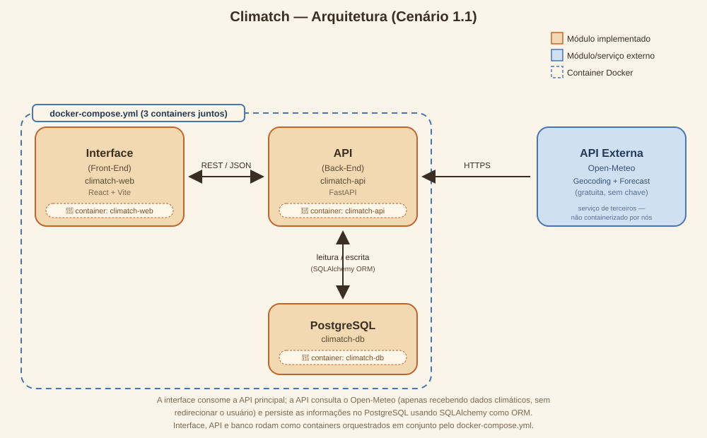

# Climatch — Interface (Front-End)

Climatch é uma aplicação para planejar eventos ao ar livre (casamentos,
corridas, churrascos, trilhas, etc.) levando em conta a previsão do tempo.
Você cadastra um evento (cidade, data, horário e tipo) e recebe na hora uma
avaliação das condições climáticas — favorável, moderada ou arriscada — além
de uma recomendação e do melhor horário do dia para realizá-lo. Também é
possível comparar várias datas candidatas para o mesmo evento e descobrir
qual delas tem a melhor previsão.

Este repositório contém a **Interface (Front-End)**, construída em
**React + Vite**, que consome a API principal do projeto
([`climatch-api`](https://github.com/laurabonilha/climatch-api)). Também é
neste repositório que fica o `docker-compose.yml` que sobe a stack completa
(banco de dados + API + interface).

## Sumário

- [Arquitetura](#arquitetura)
- [Funcionalidades](#funcionalidades)
- [Tecnologias utilizadas](#tecnologias-utilizadas)
- [API externa utilizada](#api-externa-utilizada)
- [Estrutura de pastas](#estrutura-de-pastas)
- [Como rodar o projeto](#como-rodar-o-projeto)
  - [Opção 1 — Docker Compose (recomendado)](#opção-1--docker-compose-recomendado)
  - [Opção 2 — Rodando localmente sem Docker](#opção-2--rodando-localmente-sem-docker)
- [Rotas consumidas pela interface](#rotas-consumidas-pela-interface)
- [Referência completa da API (climatch-api)](#referência-completa-da-api-climatch-api)

## Arquitetura

O projeto segue o **Cenário 1.1** proposto no MVP: uma Interface (Front-End)
que se comunica via REST com uma API principal (Back-End), que por sua vez
consome uma API externa.

```
Interface (Front-End)  <──REST/JSON──>  API (Back-End)  <──HTTPS──>  API Externa
     climatch-web              climatch-api              Open-Meteo
     React + Vite                FastAPI              (geocoding + forecast)
                                     │
                                     ▼
                              PostgreSQL (climatch-db)
```



- **Interface (Front-End)** — este repositório. Consome a API principal para
  criar, listar, atualizar e remover eventos, e para calcular a melhor data
  entre datas candidatas.
- **API (Back-End)** — repositório
  [`climatch-api`](https://github.com/laurabonilha/climatch-api). Recebe as
  requisições da interface, aplica as regras de negócio (classificação de
  risco climático por tipo de evento), persiste os dados no PostgreSQL e
  consulta a API externa quando necessário.
- **API Externa** — [Open-Meteo](https://open-meteo.com/), consumida
  exclusivamente pela API (Back-End), nunca diretamente pela interface.

## Funcionalidades

- **Cadastro de eventos**: nome, tipo, cidade, data e horário. Ao salvar, o
  evento já recebe a avaliação climática (classificação, recomendação e
  melhor horário do dia).
- **Atualização de eventos**: pensada para *refinar* um evento já existente
  (ajustar nome, horário ou descrição) e forçar uma nova consulta de
  previsão — por exemplo, conforme a data do evento se aproxima. Cidade,
  data e tipo não podem ser alterados por esse fluxo (para isso, o evento
  deve ser removido e recriado), já que mudar esses dados equivaleria a
  outro evento.
- **Remoção de eventos**.
- **Listagem de eventos** em formato de carrossel (3 cards por página, com
  navegação "anterior/próximo"), com um painel de estatísticas (favoráveis,
  moderados, arriscados).
- **Sugestão de melhor data**: informe cidade, tipo de evento e uma lista de
  datas candidatas; a API avalia todas e aponta a melhor, exibidas também em
  carrossel.

## Tecnologias utilizadas

- [React 19](https://react.dev/)
- [Vite](https://vitejs.dev/)
- [React Router](https://reactrouter.com/)
- CSS puro (sem biblioteca de componentes), com identidade visual própria
- [Nginx](https://nginx.org/) para servir os arquivos estáticos em produção/Docker
- [Docker](https://www.docker.com/) e [Docker Compose](https://docs.docker.com/compose/)

## API externa utilizada

O clima é obtido a partir da **[Open-Meteo](https://open-meteo.com/)**,
consumida pela `climatch-api`:

| Item | Detalhe |
|---|---|
| Licença | Gratuita para uso não comercial, sem necessidade de chave de API |
| Cadastro | Não é necessário criar conta nem gerar API key |
| Endpoint de geocodificação | `GET https://geocoding-api.open-meteo.com/v1/search` — converte o nome da cidade em latitude/longitude |
| Endpoint de previsão diária | `GET https://api.open-meteo.com/v1/forecast` (parâmetro `daily`) — temperatura mín/máx, chance de chuva e vento máximo do dia |
| Endpoint de previsão horária | `GET https://api.open-meteo.com/v1/forecast` (parâmetro `hourly`) — usado para encontrar o melhor horário do dia e as condições no horário do evento |

Todas as chamadas são feitas pelo **back-end** (`climatch-api`); o usuário
nunca é redirecionado para o site da Open-Meteo — os dados retornados são
tratados e combinados com as regras de negócio do Climatch antes de chegar à
interface.

## Estrutura de pastas

```
climatch-web/
├── docker-compose.yml       # orquestra climatch-db + climatch-api + climatch-web
├── Dockerfile                # build da interface (Node -> Nginx)
├── nginx.conf
├── docs/
│   └── arquitetura.svg       # diagrama de arquitetura
└── src/
    ├── api/                  # funções de acesso à API (fetch)
    ├── components/           # componentes de UI reutilizáveis (Card, Modal, Carousel, ...)
    └── features/
        ├── eventos/          # páginas e componentes da funcionalidade de eventos
        └── sugestoes-data/   # páginas e componentes da funcionalidade de melhor data
```

## Como rodar o projeto

### Pré-requisitos

- [Docker](https://docs.docker.com/get-docker/) e Docker Compose (opção 1)
- [Node.js 20+](https://nodejs.org/) (opção 2, para rodar a interface fora do Docker)

> ⚠️ **Importante**: o `docker-compose.yml` deste repositório sobe também a
> API (`climatch-api`), referenciando o código-fonte dela em `../climatch-api`.
> Por isso, **clone os dois repositórios lado a lado**, na mesma pasta pai,
> mantendo exatamente esses nomes:
>
> ```
> algum-diretorio/
> ├── climatch-web/     (este repositório)
> └── climatch-api/
> ```
>
> ```bash
> git clone https://github.com/laurabonilha/climatch-web.git
> git clone https://github.com/laurabonilha/climatch-api.git
> ```

### Opção 1 — Docker Compose (recomendado)

Sobe o banco de dados, a API e a interface de uma só vez:

```bash
cd climatch-web
docker compose up -d --build
```

Serviços disponíveis após subir:

| Serviço | URL/Porta | Descrição |
|---|---|---|
| Interface (climatch-web) | http://localhost:8080 | aplicação React servida pelo Nginx |
| API (climatch-api) | http://localhost:8001 | Swagger em http://localhost:8001/docs |
| PostgreSQL (climatch-db) | localhost:5434 | usuário `climatch` / senha `climatch123` / banco `climatch` |

Para derrubar os containers:

```bash
docker compose down
```

Para derrubar os containers **e apagar os dados do banco**:

```bash
docker compose down -v
```

### Opção 2 — Rodando localmente sem Docker

A interface aponta para `http://localhost:8001` (constante `API_URL` em
`src/api/client.js`), então a API precisa estar acessível nessa porta —
o jeito mais simples é subir só a API e o banco via Docker
(`docker compose up -d climatch-db climatch-api` a partir deste repositório,
ou seguir o README de `climatch-api` para rodar sem Docker) e então rodar a
interface localmente:

```bash
cd climatch-web
npm install
npm run dev
```

A interface ficará disponível em `http://localhost:5173` (padrão do Vite).

Outros comandos disponíveis:

```bash
npm run build     # build de produção (gera a pasta dist/)
npm run preview   # serve o build de produção localmente
npm run lint      # roda o linter (oxlint)
```

## Rotas consumidas pela interface

A interface consome as seguintes rotas da API, cobrindo os quatro métodos
HTTP exigidos:

| Método | Rota | Usado em |
|---|---|---|
| `GET` | `/eventos` | Listagem de eventos (`EventosListPage`) |
| `POST` | `/eventos` | Criação de evento (`NovoEventoPage`) |
| `PATCH` | `/eventos/{id}` | Atualização de evento — nome, horário e descrição (`EditarEventoModal`) |
| `DELETE` | `/eventos/{id}` | Remoção de evento (`EventosListPage`) |
| `GET` | `/sugestoes-data` | Listagem de sugestões de melhor data (`SugestoesDataListPage`) |
| `POST` | `/sugestoes-data` | Cálculo de melhor data (`NovaSugestaoForm`) |
| `DELETE` | `/sugestoes-data/{id}` | Remoção de sugestão (`SugestoesDataListPage`) |

## Referência completa da API (climatch-api)

A API principal expõe 7 rotas ao todo (documentadas em Swagger em
`/docs`), detalhadas no README do repositório
[`climatch-api`](https://github.com/laurabonilha/climatch-api). Ela também
implementa filtros (`?cidade=`) e ordenação nas rotas de listagem, além de
cache de previsão climática para reduzir chamadas repetidas à API externa.
